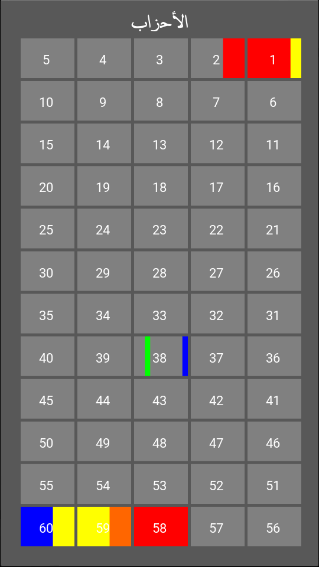

# modawin-hifz-al-quran

app for register progress of memorization of quran

## download

#### modawin-hifz-al-quran v1.0.apk (7.7 M) : [download here](https://archive.org/download/modawin/modawin-hifz-al-quran-1.0.apk)

## utilities used

Python 2.7 + Kivy 1.9.0 : language and framework used for coding

Piskel 0.14.0 : for drawing icons in pixelart style

Buildozer 0.34 : for apk and ios build, only for linux (tested on Ubuntu 16.10)

## build

### run app

install kivy if not done yet

run :

main.py with python

### mobile packaging

install buildozer if not done yet
this step is only for linux
in the app dir run:

init buildozer

buildozer -v android debug

mv .buildozer/android/platform/build/dists/lina/bin/modawinhifzalquran-1.0-debug.apk .

## contributions are welcome

for more informations or any suggestion, contribution and others contact me in faisal.adraji@gmail.com
